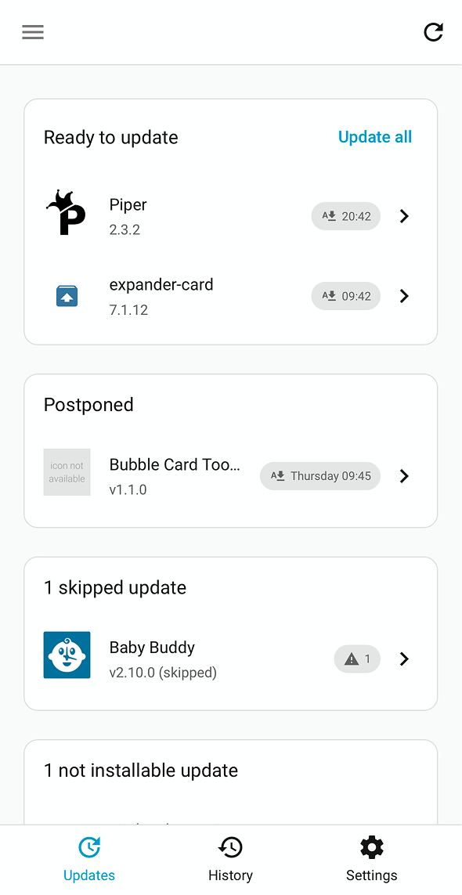
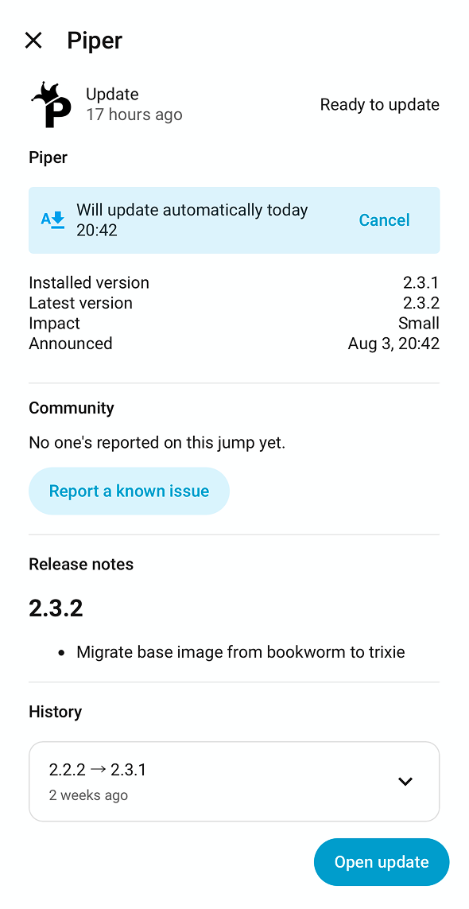
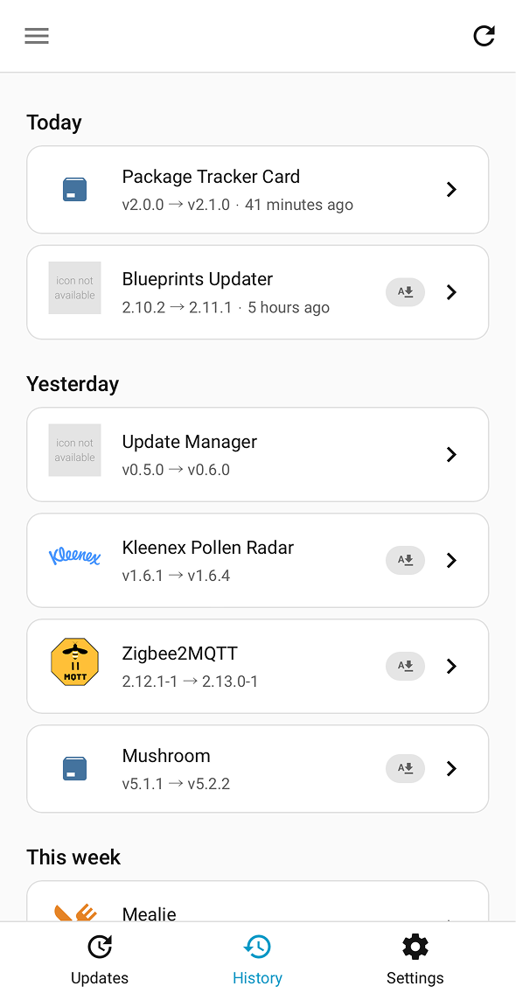

[](https://www.home-assistant.io/)
[](https://github.com/hacs/integration)

# Update Manager: Home Assistant helper integration

Updates pile up, and it's never quite obvious which ones are safe to just let happen. Update Manager
watches them for you and decides when an update has actually earned your trust: it gives a fresh release
time to prove itself, listens for anyone else who's already made the same jump and hit trouble, and
installs everything in an order that won't leave Home Assistant restarting mid-update. Turn on
auto-install and most of that becomes something you never have to think about again.

---

| Home | Dialog | History |
| :---:         |     :---:      |          :---: |
| [](images/home.png)  | [](images/dialog_autoupdate.png)     | [](images/history.png)    |

---

## Why you'll like it

* **A waiting period sized to the risk.** A small integration bump and a major Core jump don't deserve the
  same caution, so each gets its own configurable buffer before it counts as ready.
* **A second opinion before you commit.** See whether others already made your exact version jump safely,
  cast your own vote, and let one person you trust override your own rules the moment they vouch for a
  release.
* **Nothing installs in a risky order.** Core, Supervisor, OS, and device firmware queue up in the order
  that keeps a restart from cutting off something else mid-install, and Zigbee devices on the same network
  never reflash all at once.
* **Auto-install that still asks first.** A cancellable countdown announces what's coming and when, with
  an automatic backup when the update supports one, and a master switch to pause all of it in one click.
* **Release notes worth reading.** Real GitHub notes, compiled across every version a jump skips over, plus
  a wrapped app's own upstream notes (Zigbee2MQTT, Mealie, Matterbridge) alongside the short version.
* **A panel that feels like it's always been there.** Live progress, a full History audit trail, and an
  autosaving Settings tab, built from Home Assistant's own components so it looks and behaves like part of
  the app, not a separate thing bolted on.

---

## Installation

This integration isn't in the HACS default store yet, so add it as a custom repository.

[](https://my.home-assistant.io/redirect/hacs_repository/?owner=HA-Update-Manager&repository=ha-update-manager&category=integration)

1. In HACS, add `https://github.com/HA-Update-Manager/ha-update-manager` as a custom repository
   (category: Integration).
2. Install "Update Manager" and restart Home Assistant.

---

## Configuration

[](https://my.home-assistant.io/redirect/config_flow_start?domain=update_manager)

1. Navigate to **Settings > Devices & Services**, add **Update Manager**, and confirm the
   single-instance setup.
2. Open the **Update Manager** entry in the sidebar to review updates and adjust the rules (Settings
   tab).

There's nothing to fill in during setup itself; every actual setting lives on Update Manager's own
Settings tab.

## How auto-install decides

For a specific entity's pending update, in this exact order:

1. **Hard gates, nothing overrides these:** anything in Excluded entities never auto-installs, nor does
   anything skipped via Home Assistant's own "Skip this version." Home Assistant's own Core, Supervisor,
   and OS updates start out as pre-populated members of Excluded entities, so they stay manual by
   default too, but you can remove them from that list if you want them eligible for auto-install
   like anything else.
2. **A trusted voter's "healthy" vote on this exact jump wins outright**, skipping the waiting period and
   the per-size toggle, even over someone else's problem report on the same jump.
3. **Any problematic community vote blocks it** (unless step 2 already overrode it): one vote, from
   anyone, is enough. No quorum, no percentage, and no trusted voters need to be configured for this.
4. **Otherwise, your own size-based rules apply**: waiting period elapsed, size toggle on, announce, then
   install.

A blocked update shows an "Auto-install held back" alert on its dialog, naming the trusted voter or the
reported count; the Community section on that dialog shows each reported reason.

Scoping note: a vote (and this block) applies to the *exact* version jump, not any known issue along the
way. See Known limitations below.

## Automating

Every entity Update Manager creates lives under its own "Update Manager" device.

* **Status sensors**: one per status the Updates tab itself groups by: `sensor.update_manager_ready`
  ("Ready to update"), `_waiting` ("Postponed"), `_blocked` ("Discouraged"), `_skipped` ("Skipped"), and
  `_not_installable` ("Not installable"). Each sensor's state is that status's own count, with the
  affected entities (entity_id, installed/latest version) listed in its attributes: point a
  `numeric_state` trigger at one directly, e.g. to notify when anything becomes Discouraged.
* **Events**, fired on `hass.bus` for the three discrete moments an automation might want to react to:

  | Event | Fired when | Data |
  | --- | --- | --- |
  | `update_manager_announced` | An auto-install countdown starts | `entity_id`, `from_version`, `to_version`, `execute_at` |
  | `update_manager_installed` | An install completes, auto or manual alike | `entity_id`, `from_version`, `to_version`, `auto_installed`, `auto_install_reason`, `trusted_voter_usernames` |
  | `update_manager_install_failed` | An auto-install's `update.install` call raised | `entity_id`, `to_version` |

  Ongoing status (which updates are currently Ready/Postponed/etc.) is already covered by the sensors
  above; these events are only for the moments in between.

**Example: send yourself a notification for every scheduled auto-install**, the same message the built-in
persistent notification already shows, just on your phone instead:

```yaml
automation:
  - alias: "Update Manager: notify on scheduled auto-install"
    trigger:
      - trigger: event
        event_type: update_manager_announced
    variables:
      device_name: >-
        {{ state_attr(trigger.event.data.entity_id, 'friendly_name') | regex_replace("\\s*Update$", "") }}
    action:
      - action: notify.notify  # replace with your own target, e.g. notify.mobile_app_your_phone
        data:
          title: "Scheduled update"
          message: >-
            Update Manager wants to update {{ device_name }} to version {{ trigger.event.data.to_version }}
            on {{ as_timestamp(trigger.event.data.execute_at) | timestamp_custom('%d-%m-%Y %H:%M') }}.
          data:
            url: /update-manager/updates          # opens the Update Manager page on tap, iOS
            clickAction: /update-manager/updates   # same, for Android
            group: update_manager_announced        # bundles every one of these together in the notification shade
            tag: "{{ device_name }}"               # a newer announcement for the same device replaces the old one instead of stacking
            push:
              interruption-level: passive          # iOS only, quiet, no sound/wake, doesn't override Focus modes
```

## How data updates

Updates/History refresh automatically as Home Assistant reports new information. Community-vote data is
cached for up to an hour (the panel's manual refresh button forces a fresh fetch). Staging recomputes
every 15 minutes.

## Known limitations

* Staging rules apply per update *size* (small/medium/large), not per individual entity: an entity can be
  excluded entirely, but can't get its own, different waiting period.
* Voting only works for entities identifiable as a HACS integration, Home Assistant Core/Supervisor/OS,
  a recognized Zigbee device model, or an app.
* Voting requires linking a GitHub account (a quick one-time device-flow step); reading verdicts doesn't.
* A vote (and the community block) applies to the *exact* version jump. A negative verdict on 1.0.0 to
  1.0.1 has no bearing on a direct 1.0.0 to 1.0.2 jump: those are tracked as entirely separate votes.
* Zigbee rollout pacing and the safe install order only apply when Update all or auto-install triggers the
  install, or when this panel's own dialog is used for something already actively queued or held back.
  A single click on anything else opens Home Assistant's own native update dialog instead, which calls
  Home Assistant's own install service directly, with no way for Update Manager to see or pace it.

## Troubleshooting

* **A pending update isn't showing as "ready" yet**: staging recomputes every 15 minutes, so it can lag
  the exact wait-days boundary by up to that long.
* **No vote controls show for an entity**: it likely isn't identifiable for voting (see Known limitations).
* **An update still auto-installed despite a negative vote I saw**: check the vote was on this exact
  version jump (see Known limitations), and that no trusted voter's "healthy" vote was in play (it always
  wins, see "How auto-install decides").
* **A repair notification says my GitHub link has expired**: re-link it from the Settings tab; it clears
  on its own once you do.
* **A repair issue says "An update seems stuck"**: an install has been running noticeably longer than
  usual without finishing (evidence-based when the entity reports progress, a flat duration otherwise).
  This doesn't cancel the install, which may still finish on its own; it only stops that one entity from
  holding up anything waiting behind it. The same "Stop waiting" action is also one click away from the
  entity's own detail dialog, not only via **Settings > System > Repairs**.
* Check **Settings > System > Logs** (filter on "update_manager") for anything at warning level or above.

## Removal

1. Go to **Settings > Devices & Services**, find **Update Manager**, and remove it (the three-dot menu
   on its card, or open the entry and use Delete).
2. If you added it as a HACS custom repository, remove it from HACS too (Integrations tab, three-dot
   menu on Update Manager's own card).

Nothing outside Home Assistant's own storage is touched by this integration (no separate service,
container, or external account changes), so there's nothing else to clean up.
